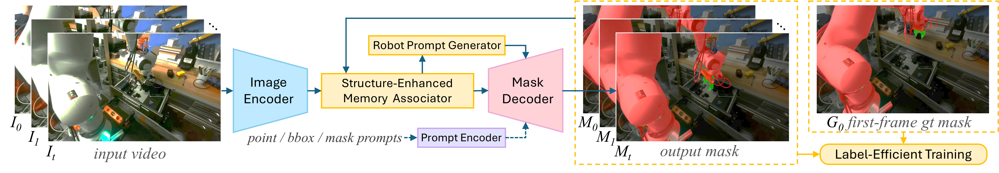
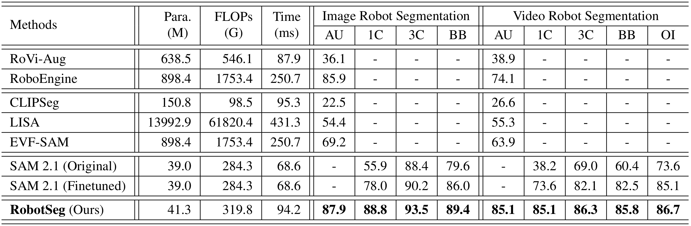
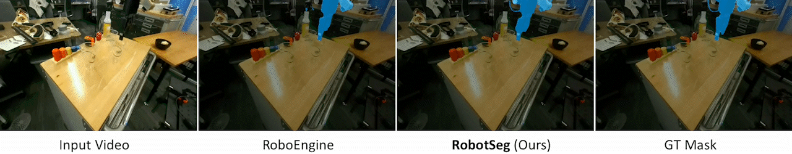
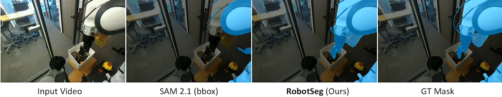

<p align="center">
    <h1 align="center">
        RobotSeg:
        <br>
        A Model and Dataset for Segmenting Robots
        <br>
        in Image and Video
    </h1>
</p>

<p align="center">
  <a href="https://mhaiyang.github.io/">Haiyang Mei</a>&nbsp;&nbsp;&nbsp;
  <a href="https://openreview.net/profile?id=~Huang_Qiming1">Qiming Huang</a>&nbsp;&nbsp;&nbsp;   
  <a href="https://haici.cc/">Hai Ci</a>&nbsp;&nbsp;&nbsp;  
  <a href="https://sites.google.com/view/showlab">Mike Zheng Shou</a><sup>✉️</sup>  
  <br>
  Show Lab, National University of Singapore
</p>

<div align="center">
  <p>
    <a href="https://arxiv.org/abs/2511.22950">
      
    </a>
    <a href="https://x.com/xxx">
      
    </a>
  </p>
</div>

<p align="center">
  
</p>


We introduce **RobotSeg**, the first foundation model for robot segmentation that : 🌈
1. supports both images and videos,
2. enables fine-grained segmentation of the robot arm, gripper, and whole robot, and 
3. offers promptable capabilities for flexible editing and annotation.


[Table of Contents](#0-table-of-contents)  
[🚀 1. Introduction](#-1-introduction)  
[⚡️ 2. Key Challenges](#-2-key-challenges)  
[🎥 3. VRS Dataset](#-3-vrs-dataset)  
[✨ 4. RobotSeg Model](#-4-robotseg-model)  
[🏆 5. State-of-the-Art Performance](#-5-state-of-the-art-performance)  
[🦾 6. Applications of RobotSeg](#-6-applications-of-robotseg)  
[🙌 7. Acknowledgments](#-7-acknowledgments)  
[📚 8. Citation](#-8-citation)


## 🚀 1. Introduction

Existing segmentation models such as SAM 1/2/3 are powerful, yet it is surprising ⚡️ that they still struggle to segment robots reliably.

We are thrilled to introduce **RobotSeg** ✨, the first foundation model and dataset designed specifically for segmenting robots in image and video.

[//]: # (RobotSeg supports automatic segmentation for both image and video, fine-grained arm–gripper–robot segmentation, and flexible promptable interaction. 🌈)

RobotSeg delivers accurate and consistent robot masks that support:  
🤖 visual servoing for VLA systems  
🧩 robot-centric data augmentation  
🏗️ real-to-sim transfer  
🛡️ safety monitoring for collision warning  

## ⚡️ 2. Key Challenges

**RobotSeg** targets four challenges that make robot segmentation uniquely difficult:

- Embodiment Diversity – robots vary dramatically in shape, size, and articulation  
- Appearance Ambiguity – their visual patterns often blend with cluttered backgrounds  
- Structural Complexity – articulated arm links, joints, and grippers form intricate structures  
- Rapid Shape Changes – fast manipulation causes large geometric and motion variations  

<p align="center">

</p>

[//]: # (**RobotSeg** delivers robust robot segmentation across diverse embodiments and scenes.)

## 🎥 3. VRS Dataset

To support comprehensive evaluation and training, we construct **VRS**, the first video robot segmentation benchmark:  
📌 **2,812 videos (138,707 frames)**  
📌 **10 robot embodiments** (Franka, Fanuc Mate, UR5, Kuka iiwa, Google Robot, MobileALOHA, xArm, WindowX, Sawyer, Hello Stretch)  
📌 Fine-grained masks for **arm**, **gripper**, and **whole robot**

<p align="center">

</p>


## ✨ 4. RobotSeg Model

Built upon [SAM 2](https://github.com/facebookresearch/sam2), RobotSeg introduces three robot-centric innovations:

✨ **Structure-Enhanced Memory Associator (SEMA)**: injects robot structural cues into memory matching to maintain stable, structure-preserving masks across video frames  
✨ **Robot Prompt Generator (RPG)**: produces semantic robot prompts that guide segmentation without requiring manual click or box inputs  
✨ **Label-Efficient Training (LET)**: supervises the model using only the first-frame ground-truth mask through cycle, semantic, and patch consistency losses

<p align="center">

</p>

## 🏆 5. State-of-the-Art Performance 
🔥 **Leading performance** over robot-specific baselines (RoVi-Aug, RoboEngine)  
🔥 Outperforms language-conditioned approaches including CLIPSeg, LISA, EVF-SAM, VideoLISA, and SAM 3  
🔥 Surpasses **SAM 2.1** across prompt settings (automatic, 1-click, 3-click, box, online-interactive)  
🔥 Lightweight: only **41.3M parameters** and **runs >10 FPS in inference**  
🔥 Robust to 10 diverse robot embodiments  

#### 5.1 Quantitative Comparison
Table below summarizes the quantitative comparisons on the RoboEngine (image) and VRS (video) datasets across diverse settings (i.e., automatic AU, 1-click 1C, 3-click 3C, bounding-box BB, and online-interactive OI). "–" denotes that the method does not support this setting. RobotSeg delivers the best segmentation performance while maintaining competitive computational efficiency.
<p align="center">

</p>


#### 5.2 Qualitative Comparison
(a) Comparison against image-level robot segmentation method RoboEngine
<p align="center">

</p>

<p align="center">

</p>

<p align="center">

</p>

(b) Comparison against general promptable segmentation method SAM 2.1
<p align="center">

</p>

<p align="center">

</p>

(c) Comparison against concept segmentation method SAM 3
<p align="center">

</p>

<p align="center">

</p>

(d) Comparison under point or box prompts
<p align="center">

</p>

<p align="center">

</p>


## 🦾 6. Applications of RobotSeg

RobotSeg delivers accurate and consistent robot masks that support:

#### 6.1 Robot-Centric Data Augmentation

Precise robot masks allow compositing the robot into new environments, generating diverse visual conditions for robust policy learning and sim-to-real adaptation.

<p align="center">  </p>

<p align="center">

</p>

#### 6.2 Robot 3D Reconstruction

RobotSeg provides accurate robot masks that can be used by modern 3D reconstruction pipelines (e.g., [SAM-3D Objects](https://github.com/facebookresearch/sam-3d-objects)) to generate high-quality robot geometry for digital-twin modeling.

<p align="center">

</p>

## 🙌 7. Acknowledgments

RobotSeg is built upon [SAM 2](https://github.com/facebookresearch/sam2).


## 📚 8. Citation
If you find our work useful, please consider citing our paper:
```
@article{mei2025robotseg,
      title={RobotSeg: A Model and Dataset for Segmenting Robots in Image and Video}, 
      author={Mei, Haiyang and Huang, Qiming and Ci, Hai and Shou, Mike Zheng},
      journal={arXiv:2511.22950},
      year={2025}
}
```

**[⬆ back to top](#-1-introduction)**