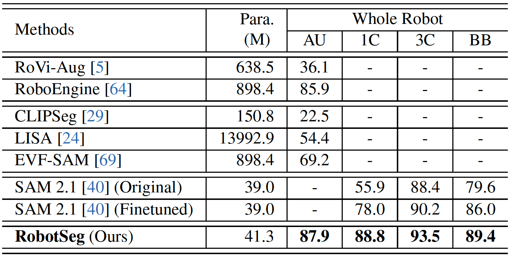
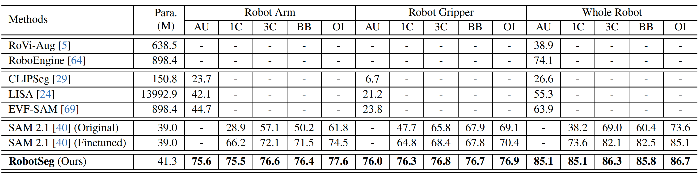
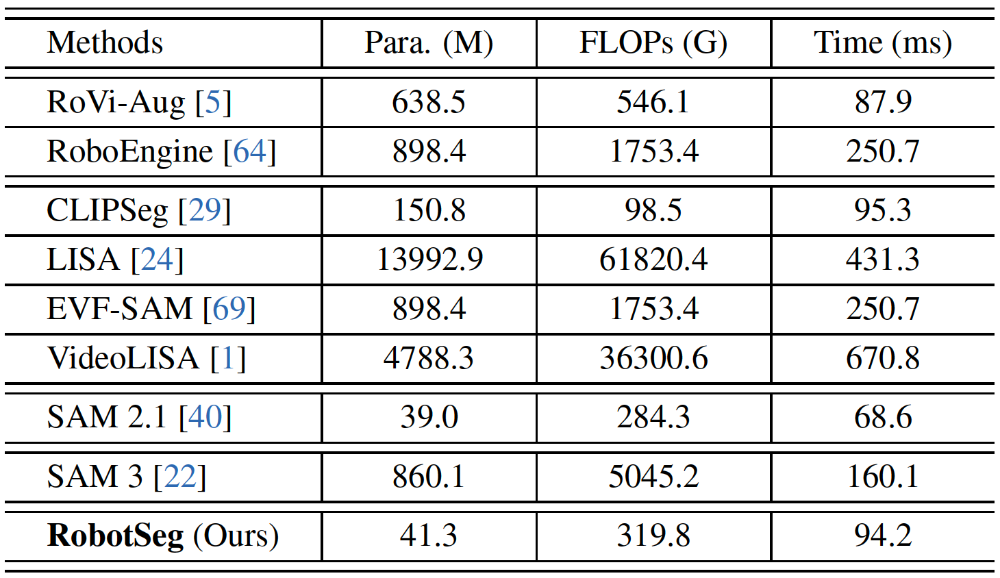
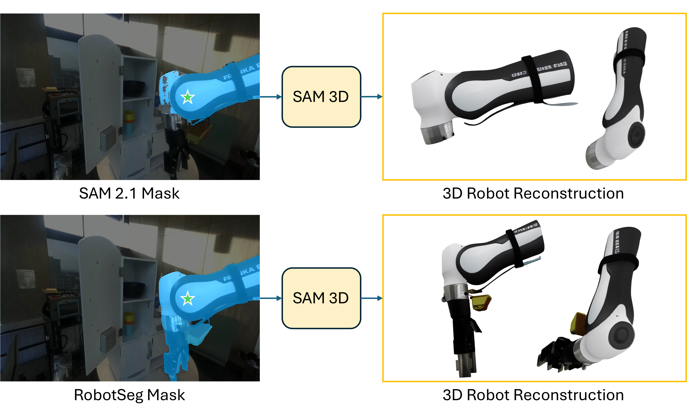

<p align="center">
    <h1 align="center">
        RobotSeg:
        <br>
        A Model and Dataset for Segmenting Robots in Image and Video
    </h1>
</p>

<p align="center">
  <a href="https://mhaiyang.github.io/">Haiyang Mei</a>&nbsp;&nbsp;&nbsp;
  <a href="https://openreview.net/profile?id=~Huang_Qiming1">Qiming Huang</a>&nbsp;&nbsp;&nbsp;   
  <a href="https://haici.cc/">Hai Ci</a>&nbsp;&nbsp;&nbsp;  
  <a href="https://sites.google.com/view/showlab">Mike Zheng Shou*</a>  
  <br>
  Show Lab, National University of Singapore
  <br>
  *Corresponding Author
</p>

<div align="center">
  <p>
    <a href="https://arxiv.org/abs/2511.xxxxx">
      
    </a>
    <a href="https://x.com/xxx">
      
    </a>
  </p>
</div>

<br>

<p align="center">
  <a href="https://showlab.github.io/RobotSeg/assets/vid_intro.mp4">
    
  </a>
</p>


We introduce **RobotSeg**, the first foundation model for robot segmentation that **(i)** supports both images and videos, **(ii)** enables fine-grained segmentation of the robot arm, gripper, and whole robot, and **(iii)** offers promptable capabilities for flexible editing and annotation.

---

This is the official repository of RobotSeg. If you find our work useful, please consider citing our paper:
```
@article{mei2025robotseg,
      title={RobotSeg: A Model and Dataset for Segmenting Robots in Image and Video}, 
      author={Mei, Haiyang and Huang, Qiming and Ci, Hai and Shou, Mike Zheng},
      journal={arXiv:2511.xxxxx},
      year={2025}
}
```


## Table of Contents

- [🚀 1. Introduction](#-1-introduction)
- [🎥 2. VRS Dataset](#-2-vrs-dataset)
- [✨ 3. RobotSeg Model](#-3-robotseg-model)
- [🏆 4. State-of-the-Art Performance](#-4-state-of-the-art-performance)
- [🦾 5. Applications of RobotSeg](#-5-applications-of-robotseg)
- [🙌 6. Acknowledgments](#-6-acknowledgments)


## 🚀 1. Introduction

Existing segmentation models such as SAM 1/2/3 are remarkably powerful, yet it is surprising ⚡️ that they still struggle to segment robots reliably.

We are thrilled to introduce **RobotSeg** ✨, the first foundation model and dataset designed specifically for segmenting robots in images and videos.

**RobotSeg** targets four challenges that make robot segmentation uniquely difficult ⚡️:

- Embodiment Diversity – robots vary dramatically in shape, size, and articulation  
- Appearance Ambiguity – their visual patterns often blend with cluttered backgrounds  
- Structural Complexity – articulated arm links, joints, and grippers form intricate structures  
- Rapid Shape Changes – fast manipulation causes large geometric and motion variations  


**RobotSeg** delivers accurate and consistent robot masks that support:  
🧩 robot-centric data augmentation  
🏗️ digital-twin reconstruction for robotic systems  
🤖 robot pose and action extraction


## 🎥 2. VRS Dataset

To support comprehensive evaluation and training, we construct **VRS**, the first video robot segmentation benchmark:  
📌 **2,812 videos (138,707 frames)**  
📌 **10 robot embodiments** (Franka, Fanuc Mate, UR5, Kuka iiwa, Google Robot, MobileALOHA, xArm, WindowX, Sawyer, Hello Stretch)  
📌 Fine-grained masks for **arm**, **gripper**, and **whole robot**


## ✨ 3. RobotSeg Model

Built upon [SAM 2](https://github.com/facebookresearch/sam2), RobotSeg introduces three robot-centric innovations:

✨ **Structure-Enhanced Memory Associator (SEMA)**: injects robot structural cues into memory matching to maintain stable, structure-preserving masks across video frames  
✨ **Robot Prompt Generator (RPG)**: produces semantic robot prompts that guide segmentation without requiring manual click or box inputs  
✨ **Label-Efficient Training (LET)**: supervises the model using only the first-frame ground-truth mask through cycle, semantic, and patch consistency losses


## 🏆 4. State-of-the-Art Performance 
🔥 **Leading performance** over robot-specific baselines (RoVi-Aug, RoboEngine)  
🔥 Outperforms language-conditioned approaches including CLIPSeg, LISA, EVF-SAM, VideoLISA, and SAM 3  
🔥 Surpasses **SAM 2.1** across prompt settings (automatic, 1-click, 3-click, box, online-interactive)  
🔥 Lightweight: only **41.3M parameters** and **runs >10 FPS in inference**  
🔥 Robust to 10 diverse robot embodiments  

#### 4.1 Comparisons of image robot segmentation


#### 4.2 Comparisons of video robot segmentation


#### 4.3 Comparisons of computational efficiency



## 🦾 5. Applications of RobotSeg

RobotSeg delivers accurate and consistent robot masks that support:

#### 5.1 Robot-Centric Data Augmentation

Precise robot masks allow compositing the robot into new environments, generating diverse visual conditions for robust policy learning and sim-to-real adaptation.

<p align="center">  </p>

#### 5.2 Robot 3D Reconstruction

RobotSeg provides accurate robot masks that can be used by modern 3D reconstruction pipelines (e.g., [SAM-3D Objects](https://github.com/facebookresearch/sam-3d-objects)) to generate high-quality robot geometry for digital-twin modeling.

<p align="center">  </p>

## 🙌 6. Acknowledgments

RobotSeg is built upon [SAM 2](https://github.com/facebookresearch/sam2).

**[⬆ back to top](#-1-introduction)**