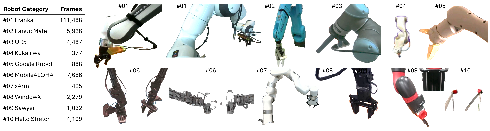

<p align="center">
    <h1 align="center">
        RobotSeg:
        <br>
        A Model and Dataset for Segmenting Robots in Image and Video
    </h1>
</p>

<p align="center">
  <a href="https://mhaiyang.github.io/">Haiyang Mei</a>&nbsp;&nbsp;&nbsp;
  <a href="https://openreview.net/profile?id=~Huang_Qiming1">Qiming Huang</a>&nbsp;&nbsp;&nbsp;   
  <a href="https://haici.cc/">Hai Ci</a>&nbsp;&nbsp;&nbsp;  
  <a href="https://sites.google.com/view/showlab">Mike Zheng Shou*</a>  
  <br>
  Show Lab, National University of Singapore
  <br>
  *Corresponding Author
</p>

<div align="center">
  <p>
    <a href="https://arxiv.org/abs/2511.xxxxx">
      
    </a>
    <a href="https://x.com/xxx">
      
    </a>
  </p>
</div>

<br>

<p align="center">
  <a href="https://showlab.github.io/RobotSeg/assets/vid_intro.mp4">
    
  </a>
</p>


We introduce **RobotSeg**, the first foundation model for robot segmentation that (i) supports both images and videos, (ii) enables fine-grained segmentation of the robot arm, gripper, and whole robot, and (iii) offers promptable capabilities for flexible editing and annotation.

---

This is the official repository of RobotSeg. If you find our work useful, please consider citing our paper:
```
@article{mei2025robotseg,
      title={RobotSeg: A Model and Dataset for Segmenting Robots in Image and Video}, 
      author={Mei, Haiyang and Huang, Qiming and Ci, Hai and Shou, Mike Zheng},
      journal={arXiv:2511.xxxxx},
      year={2025}
}
```

## Table of Contents

- [Environment Setup](#environment-setup)
- [Training](#training)
- [Evaluation](#evaluation)
- [Common Questions](#common-questions)
- [Acknowledgement](#acknowledgement)


---

## 🚀 Highlights

### ⭐ RobotSeg Model
- Extends **SAM 2** into a robot-aware video segmentation model  
- Supports **zero-click automatic segmentation**  
- Produces **structure-preserving masks**, avoiding broken links or missing grippers  
- Compact: **41.3M** parameters, smaller than robot-specific and language-conditioned baselines

### ⭐ VRS Dataset (Video Robot Segmentation)
- **2,812 videos**, **138,707 labeled frames**  
- 10+ robot embodiments  
- Hierarchical labels: robot **arm**, **gripper**, **whole robot**  
- Training uses **only first-frame annotations**, enabling label-efficient learning

### ⭐ Superior Performance
RobotSeg outperforms:
- Robot-specific models  
- Language-conditioned models  
- SAM 2.1 baseline

Across:
- Automatic (0-click)
- 1-click / 3-click prompts
- Bounding-box prompts
- Online interactive refinement

---

## 🧩 RobotSeg Method

### 1. Structure-Enhanced Memory Associator (SEMA)
- Injects multi-scale structure cues  
- Preserves thin robot parts  
- Improves temporal coherence  

### 2. Robot Prompt Generator (RPG)
- Provides robot-aware prompt tokens  
- Enables **automatic robot segmentation**  

### 3. Label-Efficient Training Strategy (LET)
- Cycle consistency  
- Semantic consistency  
- Patch-level consistency  

---

## 🎥 VRS Dataset

To support comprehensive evaluation and training, we construct **VRS**, the first video robot segmentation benchmark:  
📌 **2,812 videos (138,707 frames)**  
📌 **10 robot embodiments** (Franka, Fanuc Mate, UR5, Kuka iiwa, Google Robot, MobileALOHA, xArm, WindowX, Sawyer, Hello Stretch)  
📌 Fine-grained masks for **arm**, **gripper**, and **whole robot**




---

## 🙌 Acknowledgments

RobotSeg is built upon [SAM 2](https://github.com/facebookresearch/sam2).
